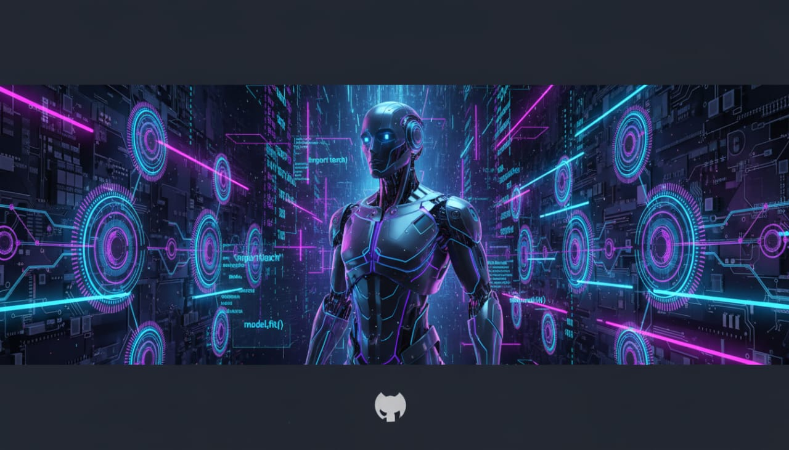

## Hi ASLAMUALIKUM ! 👋

<!--
**MalikFaiz45/MalikFaiz45** is a ✨ _special_ ✨ repository because its `README.md` (this file) appears on your GitHub profile.

Here are some ideas to get you started:

- 🔭 I’m currently working on ...
- 🌱 I’m currently learning ...
- 👯 I’m looking to collaborate on ...
- 🤔 I’m looking for help with ...
- 💬 Ask me about ...
- 📫 How to reach me: ...
- 😄 Pronouns: ...
- ⚡ Fun fact: ...
-->
<!-- ===== TOP BANNER ===== -->

  

<!-- ===== PROFILE IMAGE ===== -->

  

 

<h1 align="center">Hi 👋 I'm Faiz Anwar</h1>
<h3 align="center">
Web Developer | Python Programmer | Future AI & ML Engineer
</h3>

🚀 Passionate about technology, intelligent systems & real-world solutions

---

## 👨‍💻 About Me
🎓 BS AI Student (UNDERGRADUATE) 
🌐 Skilled in Web Development  
🐍 Python Programmer  
💻 C++ Developer  
🤖 Future *Machine Learning / AI Engineer*  
📘 Currently learning *Machine Learning from Simplilearn*

---

## 🛠️ Skills

### 🌐 Web Development
- HTML5
- CSS3
- JavaScript (Basic)

### 🧠 Programming Languages
- Python
- C++

### ⚙️ Tools & Platforms
- Git & GitHub
- VS Code
- Simplilearn (ML Learning)

---

## 🎯 Career Objective
🚀 Become a professional *AI & Machine Learning Engineer*  
🧠 Build smart systems that solve real-world problems  
🌍 Contribute to open-source & innovative tech solutions  

---

## 📚 Currently Learning
- Machine Learning (Simplilearn)
- Python for AI
- Data Concepts & Algorithms

---

## 📊 GitHub Stats

  

---

## 🔥 GitHub Streak

  

---

## 📫 Contact Me
📧 Email: malik1faiz45@gmail.com  
🌐 Portfolio: Coming Soon  

---

⭐ “Learning today to build intelligent systems for tomorrow.”
