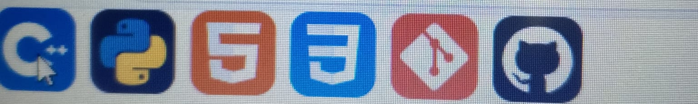
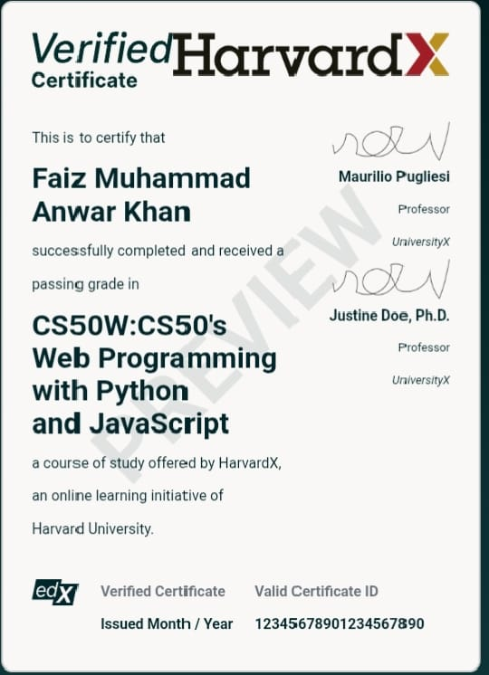
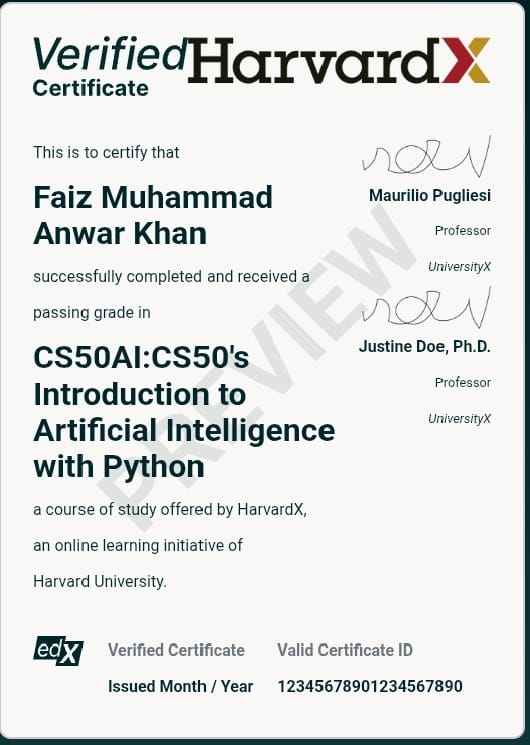

## Hi ASLAMUALIKUM ! 👋

<!--
**MalikFaiz45/MalikFaiz45** is a ✨ _special_ ✨ repository because its `README.md` (this file) appears on your GitHub profile.

Here are some ideas to get you started:

- 🔭 I’m currently working on ...
- 🌱 I’m currently learning ...
- 👯 I’m looking to collaborate on ...
- 🤔 I’m looking for help with ...
- 💬 Ask me about ...
- 📫 How to reach me: ...
- 😄 Pronouns: ...
- ⚡ Fun fact: ...
-->
<!-- ===== TOP BANNER ===== -->

  

<!-- ===== PROFILE IMAGE ===== -->

  

 
<h1 align="center">Hi 👋 I'm Faiz Anwar</h1>
<h3 align="center">
Web Developer | Python Programmer | Future AI & ML Engineer
</h3>

🚀 Passionate about technology, intelligent systems & real-world solutions

---
<h1 align="center">ABOUT ME...</h1>
<h4>🎓 BS AI Student (UNDERGRADUATE)</h4>
<h4>* Skilled in Web Development </h4>
<h4>* Python Programmer </h4>
<h4>* C++ Developer  </h4>
<h4>* Future *Machine Learning / AI Engineer*</h4>
<h4>* Currently learning *Machine Learning from Simplilearn*</h4>
---
<h1 align="center">Skills</h1>

<!-- <h2> Web Development</h2> 
<h4>* HTML5</h4>
<h4>* CSS3</h4>
<h4>* JavaScript (Basic)</h4> -->
* HTML5
* CSS3
* JavaScript (Basic)
  

### 🧠 Programming Languages
- Python
- C++
### ⚙️ Tools & Platforms
- Git & GitHub
- VS Code
- Simplilearn (ML Learning)

   

---

  <section align="left">
  <h1 align="center"> Career Objective </h1>
  <h4>🚀 Become a professional *AI & Machine Learning Engineer*  </h4>
<h4>🧠 Build smart systems that solve real-world problems</h4>  
<h4>🌍 Contribute to open-source & innovative tech solutions </h4>
     <!-- <section align="right">
      
  </section> -->
  </section>
  <section align="center">
      
      
  </section>

<h1 align="center"> Currently Learning</h1>
<h4>*  Machine Learning (Simplilearn)</h4>
<h4>*  Python for AI</h4>
<h4>* Data Concepts & Algorithms</h4>
---
<h1 align="center">Achievement...</h1>

CERTIFICATE..

  
   

 <h1 align="center"> GitHub Stats</h1>
<!-- -->

  

---
<h1 align="center">GitHub Streak </h1>

  

---

## 📫 Contact Me
📧 Email: malik1faiz45@gmail.com  
🌐 Portfolio: Coming Soon  

---

⭐ “Learning today to build intelligent systems for tomorrow.”
